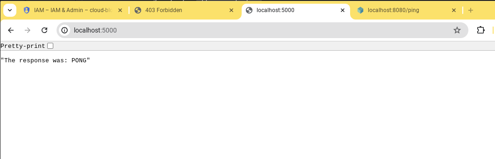

# .NET Get ID Token Sample

This Google C# sample demonstrates authenticated service to service calls using an ID token with Cloud Run.  "Service A" (this service) -> "Service B" (Authenticated).

## Git Tags

This repo is setup with 2 branches to follow along:

* `main` is the completed application with authentiation
* `unauthenticated` represents the simple application before adding the authentication

## Deploy "Service B"

This sample application uses the [helloworld test container](https://github.com/testcontainers/helloworld) image.  Deploy this as a Cloud Run service in your GCP Project:

```bash
gcloud run deploy helloworld --image testcontainers/helloworld --region us-central1
```

## App Settings

If you need to retrieve the URL of your `helloworld` service, run the following command:

```bash
gcloud run services describe helloworld --format='value(status.url)'
```

Add the following entry to your `appsettings.json` file for the location of Service B. 

```json
  {
    ...,
    "ServiceUrl": "https://helloworld-XXXXXX-uc.a.run.app"
  }
```

## User & Service Accounts

Google's [Best practices for using service accounts](https://cloud.google.com/iam/docs/best-practices-service-accounts#using_service_accounts) suggests using [service account impersonation](https://cloud.google.com/docs/authentication/use-service-account-impersonation) when developing locally.

1. Set your service account email, for example.
    ```bash
    PROJECT_ID=$(gcloud config get project)

    export SERVICE_ACCOUNT=cr-id-token@$PROJECT_ID.iam.gserviceaccount.com
    ```

1. Create your service account:
      ```bash
      gcloud iam service-accounts create $SERVICE_ACCOUNT --project $PROJECT_ID
      ```

1. Ensure that your **service account** has the `roles/run.invoker` role in order to be able to invoke another Cloud Run service.
      ```bash
      gcloud projects add-iam-policy-binding $PROJECT_ID \
            --member="serviceAccount:$SERVICE_ACCOUNT" \
            --role="roles/run.invoker"
      ```

1. Ensure that YOUR **user account** that you login interactively in the console has the `Service Account OpenID Connect Identity Token Creator` role.  **NOTE** Even if you are an administrator in your GCP Project, you will need this role or similar role which has the `iam.serviceAccounts.getOpenIdToken` permission.

1. Login using Service Account Impersonation with [Application Default Credentials](https://cloud.google.com/docs/authentication/provide-credentials-adc):

    ```bash
    gcloud auth application-default login --impersonate-service-account $SERVICE_ACCOUNT

    export GOOGLE_APPLICATION_CREDENTIALS=$HOME/.config/gcloud/application_default_credentials.json
    ```

## Running Locally

Start the application with `dotnet run` from your cli with [.NET 8 installed](https://dotnet.microsoft.com/en-us/download):


```
info: Microsoft.Hosting.Lifetime[14]
      Now listening on: http://localhost:5000
info: Microsoft.Hosting.Lifetime[0]
      Application started. Press Ctrl+C to shut down.
info: Microsoft.Hosting.Lifetime[0]
      Hosting environment: Development
info: Microsoft.Hosting.Lifetime[0]
      Content root path: /home/user/dev/id-token
```

If all goes according to plan, your AMAZING result should look like this in your browser:



## Deploying to Cloud Run using Cloud Build

The following script automates creating a Service Account with the necessary permissions (`roles/run.invoker`) and deploying the application to Cloud Run to run as that user.

```bash
./build.sh
```